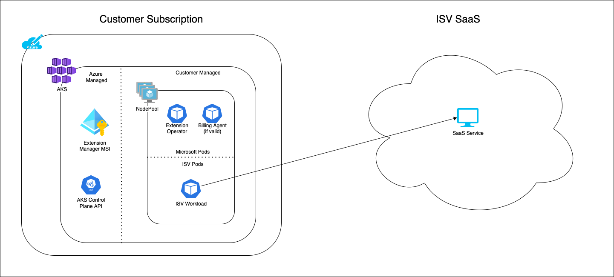
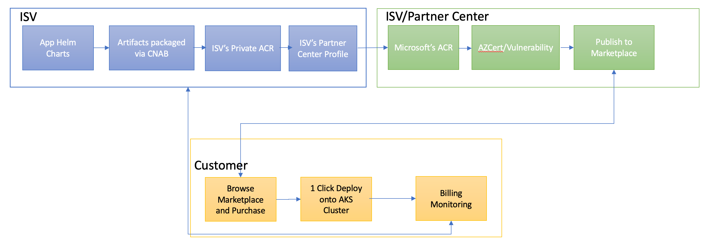

<!--
_class: lead invert
-->

# How to Win with Transactable Containers

### Presented by: Tommy Falgout | Cloud Solution Architect

---
# Agenda

- What is Transactable Container / K8s Apps in the Marketplace?
- Candidates
- Examples
- Next Steps

---

# What is Transactable Container / K8s Apps in the Marketplace (aka. TCon / K8sApps)

- Self-service marketplace for Kubernetes based applications
  - Deploy to AKS via portal
  - Transacts through the Marketplace (IP-Co Sell)
  - Software bundled via Helm Chart
- See: https://aka.ms/k8sapps
- Prerequisite: 
  - [How to Partner with Microsoft](https://lastcoolnameleft.github.io/how-to-partner-with-microsoft/)

---

# Candidates

- ISV Solution
- Solution runs in customer's AKS
- ISV does not need to manage app hands-on after deployment

---

# Examples

- Service Mesh
- Container Network Interface (CNI)
- Data Backup/Recovery
- Network Appliance (e.g. Ingress, API Gateway, Firewall, etc.)
- ML Ops (e.g. Kubeflow)

---

# Architecture

---

# End to End Flow

